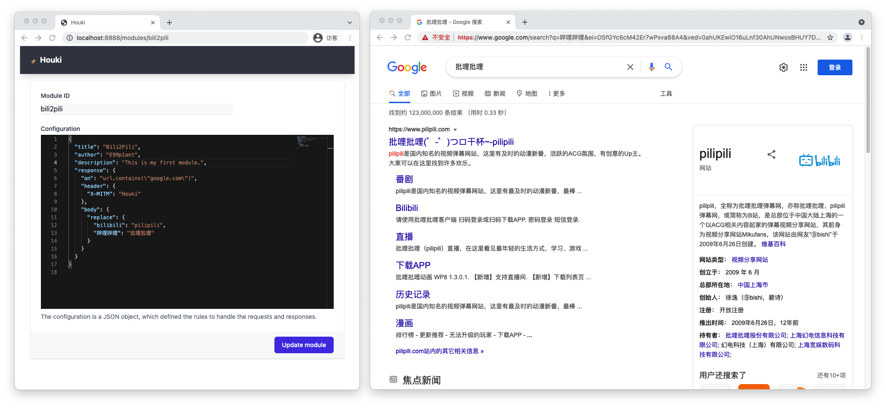

# 🧹 Houki  [](https://goreportcard.com/report/github.com/wuhan005/Houki) [](https://sourcegraph.com/github.com/wuhan005/Houki)

可定制化的中间人代理。

[]()

## 安装

1. 克隆仓库

```bash
git clone git@github.com:wuhan005/Houki.git
 ```

2. 编译程序

```bash
cd Houki

go build .
```

3. 运行程序

```bash
./Houki web
```

## 使用方法

你可以创建模块用于拦截修改 HTTP 请求与响应。

以下模块配置示例将响应体中的 `bilibili` `哔哩哔哩` 替换为 `pilipili` `批哩批哩`：

```json
{
  "title": "Bili2Pili",
  "author": "E99p1ant",
  "description": "This is my first module.",
  "response": {
    "on": "url.contains(\"bilibili.com\")",
    "header": {
      "X-MITM": "Houki"
    },
    "body": {
      "replace": {
        "bilibili": "pilipili",
        "哔哩哔哩": "批哩批哩"
      }
    }
  }
}
```

点击 `START PORXY` 启动代理，你可以手动配置浏览器代理或者点击 `OPEN BROWSER` 来直接打开浏览器。

祝你玩得开心！


## 谁是 Houki?

[Houki(ほうき)](https://zh.moegirl.org.cn/index.php?title=%E6%89%AB%E5%B8%9A(%E9%AD%94%E5%A5%B3%E4%B9%8B%E6%97%85)),
是轻小说 [*魔女之旅*](https://zh.moegirl.org.cn/%E9%AD%94%E5%A5%B3%E4%B9%8B%E6%97%85) 中主角伊蕾娜的扫帚. 伊蕾娜对其施加了
“将物品变成人”的魔法，从而获得了与伊蕾娜相似的外貌。

~~这个项目为什么叫 Houki 呢？因为我嗑伊蕾娜✕扫帚。~~

> [PixivID: 84262335](https://www.pixiv.net/artworks/84262335)

## 开源协议

MIT
